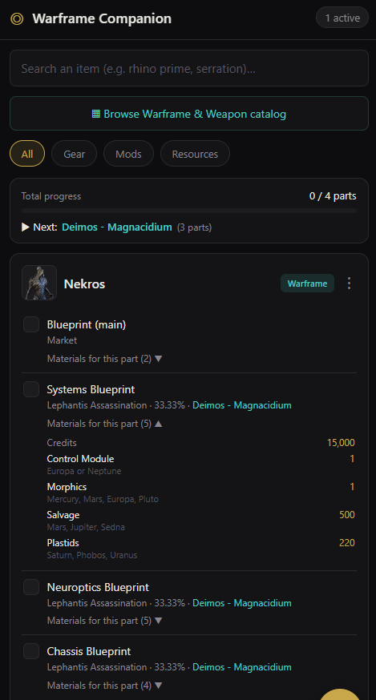

# Warframe Companion

A personal, mobile-first gameplay tracker + wiki lookup tool for Warframe.

## What it's for

In Warframe almost everything worth having — Warframes and weapons — is *built*
from several separate parts. Each part drops in a **different** place (a boss, a
mission, or a relic) and then each part needs its **own** set of crafting
materials. Keeping all of that in your head across many goals is the real chore,
and the wiki makes you dig through long articles to answer one simple question:

> **"What exactly do I have to do to get this thing?"**

That is the entire goal of this app. For every item you're chasing it gives you,
on one mobile screen and inferred straight from the wiki:

- **Every part** of the item, with a checkbox to mark what you already have.
- **Where each part comes from** — the mission/boss (and its star-chart node) or
  the relic, plus the drop chance.
- **The materials for *each* part separately**, so you never confuse which
  component needs what, and where to farm each resource.
- **Cross-references**: when the same resource feeds several goals it's flagged,
  so you farm once for many.
- **A "Next" hint**: the single location that would unlock the most parts you're
  still missing.

You can search an item or **browse a catalog** of all Warframes and weapons. No
database — persistence is just JSON files on disk, owned entirely by the backend.

## Screenshot



*Tracking **Nekros**. The summary bar shows **0 / 4 parts** and points to
**Deimos – Magnacidium** as the next run (it drops 3 of the 4 parts). Each
component lists where it drops (**Lephantis Assassination · 33.33% · Deimos –
Magnacidium**) and, expanded, the exact materials for **that** part — e.g. the
Systems Blueprint needs Credits, Control Module, Morphics, Salvage and Plastids,
each with where to farm it. The main Blueprint is bought from the **Market**.*

## Stack

- **frontend** — React + Vite, custom dark CSS, port `3000`
- **backend** — Node.js + Express, port `3001`

The frontend never calls the Warframe wiki directly; the backend proxies every
wiki request and owns the JSON store.

## Run with Docker Compose

```bash
docker-compose up --build
```

- Frontend: http://localhost:3000
- Backend:  http://localhost:3001

The backend creates `backend/data/objectives.json` and
`backend/data/completed.json` (each initialized to `[]`) on startup if missing.
These are bind-mounted, so your data survives container restarts.

## Run locally without Docker

```bash
# Terminal 1 — backend
cd backend
npm install
npm start          # listens on :3001

# Terminal 2 — frontend
cd frontend
npm install
npm run dev        # serves on :3000
```

If your backend runs on a different host/port, set `VITE_API_URL` for the
frontend (e.g. `VITE_API_URL=http://localhost:3001 npm run dev`).

## How it works

1. **Find an item** — either **search** by name (abbreviations like `neuro`,
   `sys`, `bp` are expanded) or **Browse the catalog** of every Warframe and
   weapon (filtered + de-noised from the wiki categories, with thumbnails).
2. **Add** — picking an item detects its type from the wiki categories
   (Warframe / Weapon / Mod, prime or not) and parses each part: where it drops
   (boss/mission + node, or relic), the drop %, and the materials for that part.
   A thumbnail is fetched too. The result is stored as a structured objective.
3. **Track** — check off parts (optimistic UI), mark whole items obtained,
   expand per-part or total materials. The summary bar shows global progress and
   the most useful next location; the floating **⊞** button aggregates every
   material across all active objectives, shared ones first. Objectives sort
   with the almost-complete ones first.
4. **Complete / delete** — the **⋮** menu moves an objective to
   `completed.json` (with a `completedAt` timestamp), or force a fresh re-parse
   with **↻**. Re-add anything from the *Completed* section.

### Caching

Parsed wiki data is stamped with `cachedAt`. Re-adding a recently-completed
item reuses cached data if it's under 7 days old. Use the **↻** button in a
card's menu to force a fresh re-parse from the wiki.

### Parsing fallback

Warframes and weapons are parsed from the **rendered HTML** (their
Acquisition/Crafting sections are transcluded, so per-section wikitext is
empty). Mods use the wikitext path, and if that yields nothing the backend falls
back to scraping the rendered HTML table rows (a warning is logged). If nothing
useful can be parsed the item is returned as `parsingFailed` and the UI shows a
hint instead of crashing.

### Access from other devices (same network)

The frontend derives the backend host from the URL you open it with, so opening
`http://<your-PC-LAN-IP>:3000` from a phone or tablet on the same Wi-Fi just
works — its API calls go to `http://<your-PC-LAN-IP>:3001` automatically (CORS is
open for LAN use). Find your IP with `ipconfig` (Windows) / `ip addr` (Linux),
and allow inbound TCP `3000`/`3001` in your firewall if other devices can't
connect. It's plain HTTP for home use — don't expose it to the internet.

## Project layout

```
warframe-companion/
  docker-compose.yml
  backend/
    src/
      index.js          Express entry, CORS, route mounting, store init
      store.js          ONLY module that reads/writes JSON (write-queued)
      wikiAPI.js        ONLY module that fetches the wiki (no fs)
      parser.js         ONLY parsing logic (no fetch, no fs)
      catalog.js        ONLY catalog filtering/normalization (no fetch, no fs)
      routes/
        search.js       POST /api/search
        objectives.js   CRUD + completed + refresh
        catalog.js      GET /api/catalog (cached, TTL)
        proxy.js        GET /api/wiki/proxy
    data/               objectives.json, completed.json, catalog.json
  frontend/
    src/
      App.jsx           root state + optimistic mutations
      api.js            ONLY module that calls the backend
      typeMeta.js       type icons / badges / filter buckets
      components/       Header, SearchBar, FilterChips, ObjectiveCard,
                        CompletedSection, MaterialsPanel, CatalogView,
                        SummaryBar, LoadingSkeleton, Toast
      styles/global.css dark theme + layout
```

## Architectural rules

- Frontend → backend only (never the wiki directly).
- `store.js` is the only filesystem touchpoint.
- `parser.js` has zero fetch calls; `wikiAPI.js` has zero filesystem calls.
- Plain JavaScript throughout, no TypeScript, no external UI libraries.
